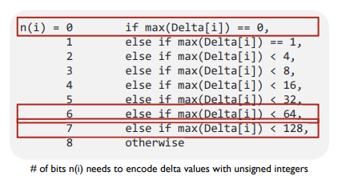
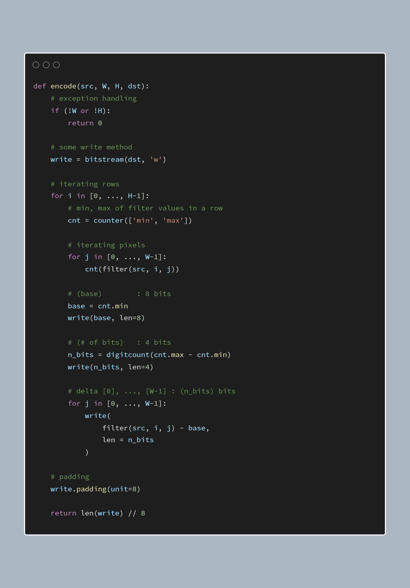

with array
1. 각 픽셀 위치에 대한 주변 평균값 구하기 -> 왼쪽, 위쪽, 좌측 위, 만약 범위 벗어날 경우 not count
2. 각 픽셀 위치에 대한 filter 구하기 -> pixel - filter // pixel < filter 일 경우 256 - filter 를 더한다.
3. row 별 min 으로 base 값 설정 후, delta 구하기
4. row 별로 delta 값의 최댓값을 기준으로 # of bits 결정
5. Base Value / # of bits / 0th ~ W-1th Delta Value 으로 인코딩 *단, Skip Delta Value when n(i) is zero
6. row 순서대로 encoded value 를 dst 에 기록, pad 0’s until it becomes a multiple of 8

without array  
선언 변수: filter, min, max, n(비트 수)
1. row 에 대한 루프
2. row 내에서 column 루프, 각 pixel 의 filter 값을 탐색, min, max 갱신
3. column 루프 종료 후 max - min 을 이용해 n값 결정, base 값은 min 값을 할당
   
4. base 값과 n 값을 dst에 쓴다.
5. n이 0이 아니라면, 다시 column 루프로 들어가 filter 값을 구하고, delta 값을 계산해 dst에 집어넣는다.
6. row 루프가 종료되면, padding 해준다.

bitWrite 매커니즘
// 기존 000000... 에다가 쓰고자 하는 bit 101010.... 로 or 를 취하면 쓰고자 하는 bit 값이 들어간다.  
// 기존 101010...에다가 0000000....로 or를 취하면 기존 값이 유지가 된다.  
// 11111... 로 or를 취하면 11111로 초기화, 00000....로 and를 취하면 0으로 초기화  
// 내 코드에서는 0으로 초기화한 뒤 쓰는 쪽으로 설계  
// -> 이것과 >>, << 연산자를 이용해서 bit writing function을 만들어야 한다.  
// bit 단위의 bitPos 변수를 이용하자. 8을 기준으로 몫(p + n으로 접근)과 나머지(비트 단위의 칸을 의미)를 이용하면 된다.  
// 인자로 넘겨줄 값은? u8 변수의 값과 몇 비트짜리인지에 대한 정보.  
// 비트를 끊어서 써주는 경우를 신경써줘야 한다.  