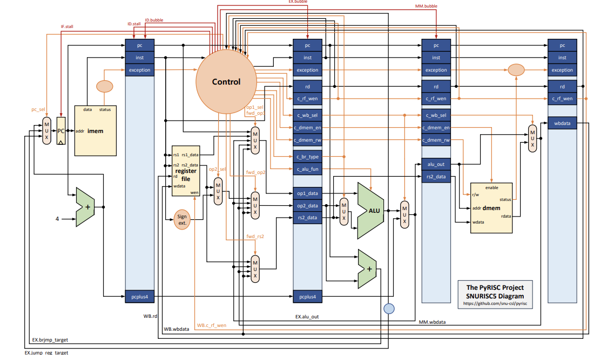

1. 변수명에 관한 것
CTL = control
EX.reg_pc -> ID/EX의 pc값을 저장하는 파이프라인 레지스터
Pipe.ID.pc -> ID stage의 pc값

2. Push와 POP은 어떤 hazard를 동반하는가?
-> rs1이나 rd가 sp이면 골때린다.
- Push: ID에서 Push인지 검증 후 rs1와 rd를 2(=sp)로 수정한다. imm value를 4로 두고 메모리에 접근할 주소를 계산한다.
- 메모리에 접근하여 값을 갱신한 후 ALU의 연산 결과를 sp에 쓴다.(sp = sp - 4)
- 이렇게 하면 PUSH는 기존 파이프라인 포워딩으로 구현 가능함.

- POP: pop은 lw-use hazard도 고려해줘야함. -> 기존 코드 확인
- 또한 이새끼는 값을 두 번 갱신해줘야함. 이게 큰 문제임.
- 일단 ALU를 사용해서, Reg(sp) - 4를 계산한다. 얘를 line에 태워야함. 추가적인 adder를 임시로 사용해서 sp로 접근하긴 해야됨.
- 기존 rd는 wbdata로 갱신하고, sp는 추가 reg를 할당해서 해결한다.

- POP을 포워딩할때 무엇을 포워딩해와야하는지를 결정하는 로직이 조금 복잡한거임..
- 
- SP+-4는 alu_out에, Mem[sp] 값은 wbdata에 있어야 한다.

- forward 로직
- case를 나눠보자: push -> pop / pop -> push인 경우. 가장 까다롭다,,ㅋ
- sp를 forwarding 시, push는 rs1으로, pop도 rs1으로(op1이 되는거임.)
- 인자를 forwarding 시, push에서 rs2만,,(얘는 op2가 아니라 rs2만)
- 인자의 경우는 기존 코드로 가능, sp forwarding에서 push와 pop이 같은 인자를 갖고, 연달아 등장할 경우 load-use hazard가 겹친다. 이때 어떤 단계에서 forwarding을 할 것인지는 명확하나, 어떤 값을 가져올지가 불명확함.
- 따라서 파이프라인 레지스터를 새로 추가하고, ID에서 무엇을 포워딩할지 경우를 나눠 해결하였다.
- push -> 일반 / 
- 만약 rs1이 sp라면? 아 씨발
- push랑 pop 따로 구현해줘야할듯,,
- push: SP-4로 메모리에 접근 후, SP-4 값을 SP에 써줘야함. 즉, RS1을 2로 바꾸고 RD도 2로 바꾸고 

- push는 rs2를 갖고, pop은 rd만 가짐

- POP이 hazard를 유발하면, MM이나 WB에서 ALU연산결과를 땡겨와야 하는 상황이 발생함.
- 이는 기존 코드로 해결이 안됨, 왜냐면 pop에서는 rd != sp이기 때문임
- op2, rs2에 대해서도 테스트 필요해보임. 얘네 덜 구현된 것 같은데?

3. BTB 구현 가보자 -> 객체 deep copy 유의할 것
EX.reg_pc -> ID/EX의 pc값을 저장하는 파이프라인 레지스터
Pipe.ID.pc -> ID stage의 pc값
- The BTB is checked in the IF stage in the compute(self) function
- The BTB is updated in the EX stage in the update(self) function
- 비록 jal이라도, BTB에서 no라고 하면 no로 먼저 동작 후? EX stage에서 확인 후 분기해야함.
- 리스트 안에 객체(valid bit, Tag, Target Addr)를 집어넣는 식으로 하면 될듯 -> 그 객체의 equal 함수를 정의해줘야함? 얕은 복사? 아무튼 조심해라
- 구현 흐름: 아래 영어 번역해라(README임)
- The valid bit indicates whether the corresponding entry has a valid information. Initially, all the entries in the BTB are set to be invalid. The tag bits represent the address of a branch instruction. And the target address has the address to jump when the branch is taken.

In the IF stage, the instruction memory (imem) and the BTB are accessed simultaneously with the same pc. If the pc of the fetched instruction matches a tag in the BTB, then it indicates that the instruction is a branch and it was taken previously. In this case, the current branch instruction is also predicted as taken, and the corresponding target address is used as the next pc. If the matching entry is not found in the BTB, the current instruction is either (1) a branch instruction which were not taken previously, or (2) not a branch instruction at all. In both cases, the next instruction at pc + 4 will be fetched.

The branch outcome is known at the end of the EX stage. If the prediction using the BTB was right, we have nothing to do. When the prediction was wrong, we need to cancel two instructions in the IF and ID stages, and fetch the right instruction. Also, when the branch is predicted to be taken but it was not taken, we should make the corresponding entry in the BTB invalid. Likewise, when the branch is predicted to be not-taken but it was taken, we should add an entry for the current branch instruction to the BTB.
- IF단에서 inst의 pc로 imem 접근 & BTB 접근 -> if hit, then 바로 분기,  // ctr에서 새로운 상태를 하나 만들어야한다.IF에서 분기하는건 별도 상태로 필요할듯,,
- 분기할 때 target addr를 이용한다. 이건 메소드의 리턴값을 이용
- miss면 PC + 4임
- 만약 IF에도 브랜치, EX에도 브랜치라면? 무엇을 우선시해야할까,, -> IF, ID를 flush해야하니까 EX를 우선시하는게 맞을 듯!
- EX단에서, pc로 BTB접근, prediction과 실제 분기결과를 따져준다.
- 맞다면 패쓰, 틀렸으면 분기 여부에 따라 add or remove로 갱신

구현할 것:
- PC값 업데이트 조건은 무조건 CTL에서 해결한다. 0~3으로 mux 만드는거임
- IF와 EX 둘 다 분기해서 충돌하는 경우를 복잡해도 CTL에서 해결해줘야 한다.
- reg 및 datapath: btb_result를 EX.reg까지 쭉 이어줌. -> ㅇㅇ
- IF에서: lookup 결과를 path에 저장 후, CTL.gen()으로 다음 pc값 결정
- EX에서: Update로직 -> 이거 그냥 gen() 때리고 isBranching 따져서 업데이트하면 됨. IF결과는 알빠노? 씨발련아 알빠노? 씨@발련아 ㅋㅋ
- CTL.gen(): 분기조건 따지기, flush 조건 따지기
- BTB 객체 -> ㅇㅇ
- ctl에서 flush 조건이 분기여부가 아닌 적중여부로 바뀌어야함: JALR이거나 틀렸을 때 flush
- branching 때렸던 애가 만약 틀렸다면? 이거 다시 되돌려야함..

최종적인 nextpc를 ID.update에서 결정하자.

